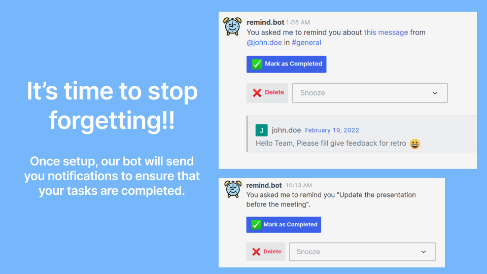
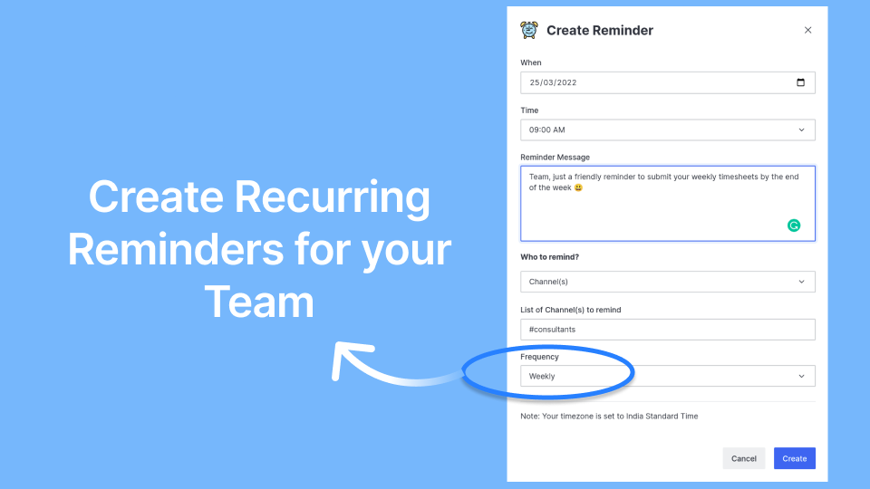

# What is Reminder Bot?

Reminder Bot in Rocket.Chat allows you to set up reminders for yourself or for your team, directly from Rocket.Chat.&#x20;

Use the `/remind` slashcommand or shortcuts menu to set reminders for yourself, someone else in your team, or even an entire channel. You can also set reminders from specific messages that you’d like to come back to later. It also allows you to automate some of your team's workflows using Recurring Reminders.

### Guides: Jump right in

Follow our handy guides to get started on the basics as quickly as possible:


[installation](guides/installation/)



[setting-up-reminders](guides/setting-up-reminders/)



[managing-reminders](guides/managing-reminders/)



[premium-license](guides/premium-license/)


### Features:

.png>)

.png>)
