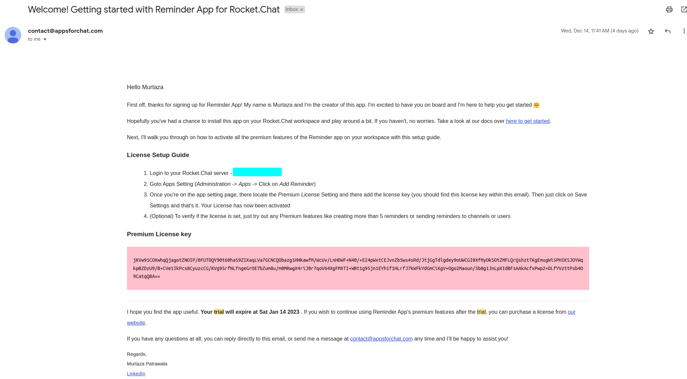

# Start a free trial

Sign up for a free trial of our Premium features and get access to all advanced features of Reminder Bot for 30 days. Follow the following guide and start your trial today.

1.  Go to [our website](https://appsforchat.com/reminder-app) and scroll down to locate the "Start Trial" button.\

    <figure><figcaption></figcaption></figure>
2. Next, it will ask you for some details. Please fill it out and click "Start Trial".
3.  Check your Email address for mail from us with your License. It should look something like this\

    <figure><figcaption>
Sample trial email
</figcaption></figure>


If you don't receive the email within a few minutes, please check your spam folder. If you still don't receive the email, please contact us at [contact@appsforchat.com](mailto:contact@appsforchat.com) with your workspace address and we'll quickly get back to you.


&#x20; Next, check out this guide on how to set up this license in your workspace


[how-to-set-up-your-license-on-rocket.chat-server.md](how-to-set-up-your-license-on-rocket.chat-server.md)

